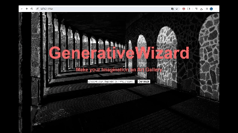

# GenerativeWizard

<table align="center">
  <tr>
    <td align="center">
      
<b>Image generated from the prompt <i>Painting of Manhattan, Van Gogh style</i></b>

      
    </td>
    <td>
      
<b>Application Demo</b>

      
    </td>
  </tr>
</table>

### Overview of the Repository
- `templates/`: Contains the `index.html` file, which defines the structure and overall layout of the web interface.
- `static/`: Comprises both the `styles.css` and `javascript.js` files used for styling, animation and interactivity.
- `utils/`: Directory containing utility files: on the one hand, `utils.py` encompasses essential functions and classes used throughout the application and, on the other hand, `setup.py` accounts for the configuration file for packaging the utils module.
- `Dockerfile`: Provides instructions for building a Docker image to run the FastAPI web application.
- `docker-compose.yml`: Specifies the configuration for running the application with Docker Compose.
- `main.py`: Contains the code for the server-side logic of the FastAPI application.
- `requirements.txt`: Lists all the necessary libraries and dependencies required to run the FastAPI web application.

### How to run?
**From terminal**
1. Clone the project repository: `git clone https://github.com/OneLeoTav/GenerativeWizard.git`
2. Navigate to the root of the directory `cd GenerativeWizard/`
3. Run `uvicorn --reload main:app`
4. Open your preferred web brower and access the application at http://[127.0.0.1:8000](http://127.0.0.1:8000/). It might take a few minutes to load, as the image genration pipeline needs to be loaded (once) for the first time.

**From Docker**
1. Navigate to the Docker sub-directory `cd GenerativeWizard/Docker`
2. Build the Docker image with the command: `docker build -t genwizardimage .`
3. Launch the container using the command: `docker run -d --name genwizardcontainer -p 5000:80 genwizardimage`
4. Acess the application at [http://127.0.0.1:8000/](http://127.0.0.1:8000/)
Alternatively, you can use the following command to leverage the `docker-compose.yml`file: `docker compuse up`. However, it is worth emphasizing that the creation of the image is pretty slow, especially the `RUN pip install --upgrade pip && pip install --no-cache-dir -r /code/requirements.txt` command, owing to the multiple sub-dependencies from Diffusers and PyTorch.

## Project Outline
GenerativeWizard is aa text-to-image Web application. Powered by the [runwayml/stable-diffusion-v1-5](https://huggingface.co/runwayml/stable-diffusion-v1-5) model, the interface returns the image generated from the user prompt, which you can then download. However, you better be equipped with a GPU, or else you have enough time to pour yourself a cup of tea while waiting for the image to be generated (c. 10 minutes with Intel Core i5 CPUs).

### Main Features
- **Text-to-Image Generation:** Easily transform texts into high-quality images.
- **Downloadable Content:** Save your creations as images (PNG) for sharing as well as any other use relevant to you.
- **User-Friendly Interface:** Enjoy an ergonomic and intuitive interface for easy navigation.

### Technologies Used
- **Python:** Backend development and integration of text-to-image generation models.
- **FastAPI:** Web framework for building the backend server and handling HTTP requests.
- **Diffusers:** Loading the model and creating the pipeline.
- **PyTorch:** Management of tensor allocation between CPU and GPU, based on user hardware specifications.
- **PIL (Python Imaging Library):** Image processing library for manipulating images.
- **HTML/CSS/JavaScript:** Front-end development to create the user interface and implement interactive features.
- **Base64 Encoding:** Encoding, via base64 and I/O modules, for transferring image data between from the server-side to the client-side.

## Aperçu du Projet
GenerativeWizard est une application Web de text-to-image. Alimentée par le modèle [runwayml/stable-diffusion-v1-5](https://huggingface.co/runwayml/stable-diffusion-v1-5), l’interface renvoie l’image générée à partir du prompt utilisateur, que vous pouvez ensuite télécharger. Toutefois, vous feriez mieux d'être équipé d'un GPU, sinon vous avez largement le temps d'aller vous servir un café (environ 10 minutes avec Intel Core i5 CPU).

**Principales fonctionnalités :**
- **Génération de texte en image :** Transformez facilement des textes en images de haute qualité.
- **Contenu téléchargeable :** Sauvegardez vos créations sous forme d'images (PNG) pour les partager et les conserver.
- **Interface ergonomique:** Profitez d'une interface simple et intuitive pour une navigation facilitée.

**Technologie utilisées :**
- **Python :** Développement backend et intégration des modèles de génération de texte en image.
- **FastAPI :** Framework web pour la construction du serveur backend et la gestion des requêtes HTTP.
- **Diffusers :** Chargement du modèle et création du pipeline.
- **PyTorch :** Gestion de l’allocation des tenseurs entre le CPU et le GPU, en fonction des spécifications hardware de l’utilisateur.
- **PIL (Python Imaging Library) :** Bibliothèque de traitement d'images pour manipuler les images.
- **HTML/CSS/JavaScript :** Développement frontend pour créer l'interface utilisateur et implémenter des fonctionnalités interactives.
- **Encodage Base64 :** Encodage, via les modules base64 et I/O, pour le transfert de données d'image entre le serveur et le client.

## Panorama del Proyecto
GenerativeWizard es una aplicación web de GenAI intuitiva que transforma texto en imágenes visuales cautivadoras (texto a imagen). Impulsada por el modelo [runwayml/stable-diffusion-v1-5](https://huggingface.co/runwayml/stable-diffusion-v1-5), la interfaz devuelve la imagen generada a partir del texto introducido por el usuario, la cual luego puedes descargar. Sin embargo, mejor se vale estar equipado con una GPU, o de lo contrario tendrá tiempo suficiente para prepararse un baño mientras se genera la imagen (alrededor de 10 minutos con Intel Core i5 CPUs).

**Funcionalidades principales:**
1. **Generación de Texto a Imagen:** Transforme fácilmente textos en imágenes de alta calidad.
2. **Contenido Descargable:** Guarde sus creaciones como imágenes (PNG) para compartir o cualquier otro uso que le apetezca.
3. **Interfaz Ergonómico:** Disfrute de una interfaz simple e intuitiva para una navegación facilitada.

**Tecnologías utilizadas:**
- **Python:** Desarrollo del backend e integración de modelos de generación de texto a imagen.
- **FastAPI:** Framework web para construir el servidor backend y manejar solicitudes HTTP.
- **Diffusers:** Carga del modelo y creación del pipeline.
- **PyTorch:** Gestión de la asignación de tensores entre CPU y GPU, según las especificaciones del hardware del usuario.
- **PIL (Python Imaging Library):** Biblioteca de procesamiento y manipulación de imágenes.
- **HTML/CSS/JavaScript:** Desarrollo front-end e implementación de características interactivas.
- **Base64:** Codificación, a través de los módulos Python base64 y I/O, para transferir datos de imagen entre el servidor y el cliente.
